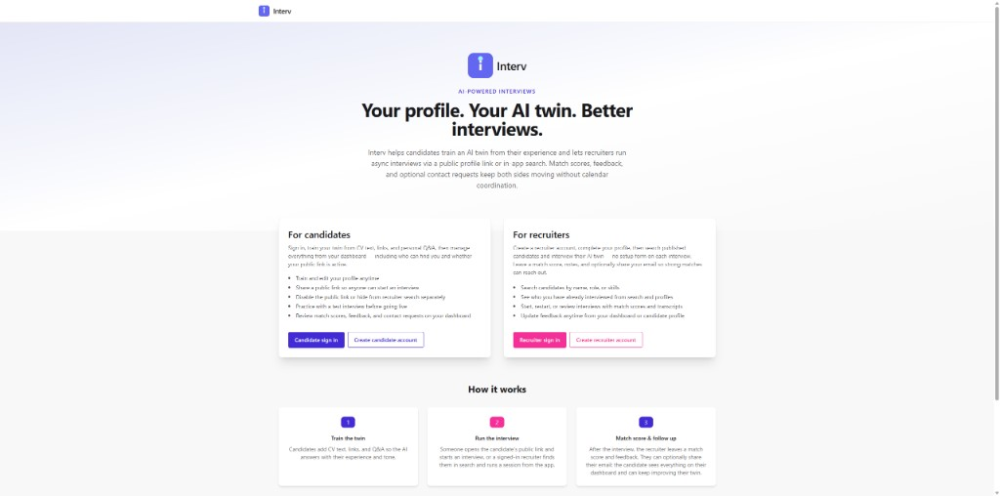
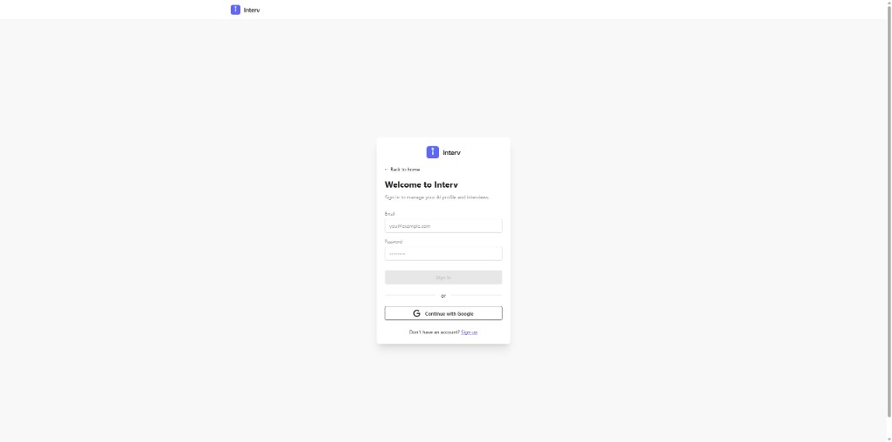
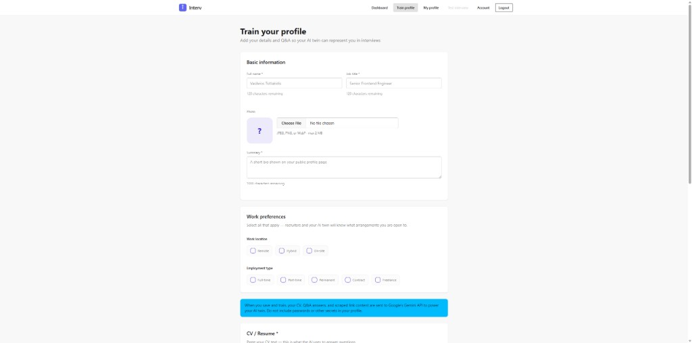
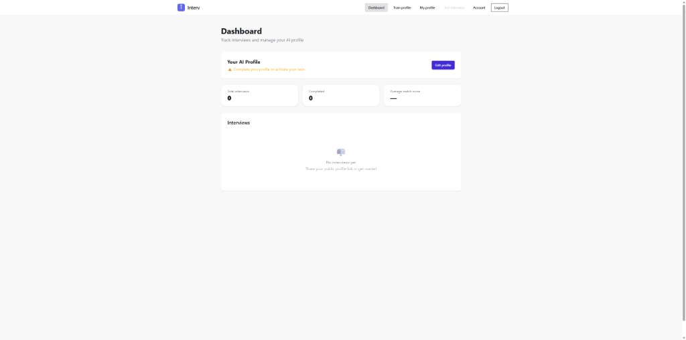
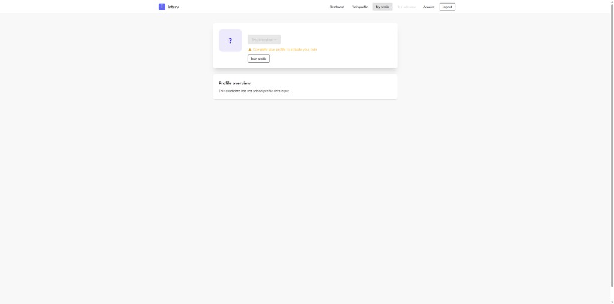

# Interv

**Async AI interviews for modern hiring.** Candidates train an AI twin from their CV, links, and personal Q&A; recruiters (or anyone with a public link) run conversational interviews against that twin, then leave match scores and feedback.

> **Demo / work in progress** — This repository is a functional prototype, not a finished product. Flows, copy, rate limits, and infrastructure may change. Use the hosted demo to explore; expect rough edges and missing polish.

**Live demo:** [https://getinterv.web.app/](https://getinterv.web.app/)

---

## What it does

| Role | Capabilities |
|------|----------------|
| **Candidate** | Sign in, build a profile, **train** the AI twin (ingest + RAG), share a public profile link, run a **test interview**, manage visibility, review interviews and match scores on a dashboard |
| **Recruiter** | Sign in, complete a recruiter profile, search published candidates, start/restart interviews, leave feedback and optional contact details |
| **Visitor** | Open a candidate’s public link and start an interview (when the candidate has enabled their public profile) |

The product goal is **calendar-free screening**: the twin answers in the candidate’s voice using retrieved context, while humans review transcripts and scores afterward.

---

## AI architecture (core)

Interv’s “AI twin” is not a single prompt — it combines **profile data in Firestore**, **vector RAG**, and **streaming Gemini** chat.

### 1. Train (ingest)

When a candidate clicks **Save & train AI** on [Train profile](https://getinterv.web.app/candidate/train-profile):

1. The Angular app saves `profiles/{uid}` in **Firestore** (name, title, summary, CV text, links, personal Q&A, work preferences, etc.).
2. The app calls `POST /ingest/{profileId}` on the **FastAPI** backend (authenticated as the profile owner).
3. The backend:
   - Validates and trims payloads (`backend/services/request_validation.py`, `api_limits.py`).
   - Optionally **scrapes** GitHub/website links (`link_scraper.py`); LinkedIn URLs are stored but not scraped.
   - Uses **Gemini** (`GEMINI_PROFILE_MODEL`, default `gemini-3.1-pro-preview`) to **extract skills** from CV text.
   - **Chunks** CV, Q&A answers, and scraped link text (`backend/services/rag.py`).
   - **Upserts** embeddings into a per-profile **Chroma** collection (`vector_store.py`).
   - Writes ingest metadata and `ragEnabled` on the profile document.

The train screen shows a privacy notice: CV, Q&A, and scraped link content are sent to **Google’s Gemini API** to power the twin.

### 2. Interview (chat)

During a live interview (public link, recruiter flow, or candidate **test interview**):

1. The Angular **InterviewFacade** opens a **WebSocket** to `/chat/ws/{profileId}/{interviewId}`.
2. For each recruiter message, the backend:
   - Loads the profile from Firestore.
   - **Retrieves** relevant chunks with RAG (`get_relevant_context`) — query embedding + Chroma similarity search, timeout ~12s.
   - Builds a **system prompt** that instructs the model to speak in **first person** as the candidate, grounded in retrieved context (`build_system_prompt` in `backend/routers/chat.py`).
   - **Streams** the reply with Gemini (`GEMINI_CHAT_MODEL`, default `gemini-3-flash-preview`) back over the WebSocket.
3. Messages and interview state are persisted under `profiles/{id}/interviews/{interviewId}` in Firestore.
4. Turn limits, rate limits, and suggested starter questions are enforced on both client and server.

### 3. Post-interview

- Recruiters can submit **match score** and feedback (stored on the interview document).
- Candidates see scores and transcripts on the **dashboard**; self **test interviews** do not require recruiter feedback.
- Optional **AI summary** and suggested-question endpoints use Gemini with separate quotas (`usage_rate_limit.py`).

### AI-related backend layout

```
backend/
├── main.py                 # FastAPI app, CORS (includes getinterv.web.app)
├── routers/
│   ├── ingest.py           # Profile training → RAG + skills
│   ├── chat.py             # WebSocket interview twin
│   ├── interviews.py       # CRUD, summaries, suggested questions
│   └── profiles.py         # Personal Q&A generation, etc.
└── services/
    ├── gemini.py           # Google GenAI client (chat + profile models)
    ├── rag.py              # Chunk, ingest, retrieve
    ├── vector_store.py     # Chroma per profile
    ├── skills.py           # CV → skills via Gemini
    └── link_scraper.py      # Optional link content for RAG
```

### Prerequisites for AI locally

Copy `backend/.env.example` → `backend/.env` and set at minimum:

- `GEMINI_API_KEY` — required for train + chat
- `FIREBASE_SERVICE_ACCOUNT_KEY` — path or JSON for Admin SDK (Firestore, auth verification)
- Chroma must be available (see `vector_store.py`; ingest skips RAG if the store is down)

Without a trained profile (name, title, summary, CV + successful ingest), interviews cannot start — the UI blocks **Test interview** until the profile is complete.

---

## Candidate flow (untrained profile)

Screenshots below show the path **before** “Save & train AI” has produced a ready twin: navigation is visible, but test interview stays disabled and the dashboard warns that the twin is not active.

### Home

Landing page explains candidates vs recruiters and the three-step flow (train → interview → match score).



### Sign in

Candidate authentication (email/password or Google).



### Train profile

Where AI training happens: CV text, personal Q&A, links, work preferences, and the Gemini privacy banner. Until this form is saved and ingest succeeds, the twin is not ready.



### Dashboard (profile not complete)

Shows **“Complete your profile to activate your twin”** and empty interview stats. **Test interview** in the header is disabled.



### My profile (owner view, untrained)

**Test interview** button is disabled with the same warning; **Train profile** is the primary call to action.



After training, the same pages enable test interview, public link copy, visibility toggles, and live AI chat.

---

## Tech stack

| Layer | Technologies |
|-------|----------------|
| **Frontend** | Angular 21 (standalone, signals, `@if` / `@for`), Nx monorepo, Tailwind CSS 4, DaisyUI |
| **State** | NgRx Signal Stores (`@ngrx/signals`) — facades per domain |
| **Auth & data** | Firebase Auth, Firestore, Storage |
| **API** | Python **FastAPI**, Uvicorn |
| **AI** | **Google Gemini** (GenAI SDK), **Chroma** vector store, custom RAG |
| **Realtime** | WebSockets (interview streaming) |
| **Hosting** | Firebase Hosting (demo: `getinterv.web.app`) |
| **Tests** | Vitest (libs), Playwright (e2e) |

---

## Repository structure

Nx workspace with path aliases in `tsconfig.base.json`:

```
interv/
├── src/                    # Shell app (routes, app component, environments)
├── public/                 # Static assets (favicon.svg)
├── libs/
│   ├── shared/             # UI (header, logo, modals), models, constants
│   ├── home/               # Marketing landing
│   ├── auth/               # Login / register (candidate + recruiter)
│   ├── candidate-profile/  # Train profile, public/owner profile views
│   ├── candidate-dashboard/# Dashboard, interview list & detail
│   ├── interview/          # Interview UI, setup, summary, transcript
│   ├── recruiter/          # Recruiter dashboard, candidates, profile
│   ├── recruiter-feedback/ # Feedback panel
│   └── states/             # Signal stores + services
│       ├── auth/        # Auth store, AuthSyncService, account API
│       ├── profile/        # Profile load/save, ingestToRAG
│       ├── interview/      # WebSocket interview facade
│       ├── dashboard/
│       └── recruiter/
├── backend/                # FastAPI AI + interview API
├── docs/screenshots/       # README images
├── firestore.rules
└── e2e/                    # Playwright tests
```

**Routing** (see `src/app/app.routes.ts`):

- `/` — home  
- `/login`, `/register` — candidate auth  
- `/recruiter/*` — recruiter auth and app  
- `/candidate/dashboard`, `/candidate/train-profile`, `/candidate/my-profile`, `/candidate/test-interview`  
- `/candidate/:profileId` — public profile + interview entry  

---

## Local development

### Requirements

- Node.js `^20.19` / `^22.12` / `>=24` (see `package.json`)
- Python 3.11+ for the backend
- Firebase project (Auth, Firestore, Storage) matching `src/environments/environment.ts`
- `GEMINI_API_KEY` and Firebase service account for the API

### Install

```sh
npm install
cd backend
python -m venv venv
# Windows: venv\Scripts\activate
# macOS/Linux: source venv/bin/activate
pip install -r requirements.txt
cp .env.example .env
# Edit .env — set GEMINI_API_KEY and FIREBASE_SERVICE_ACCOUNT_KEY
```

### Run frontend + API together

```sh
npm run start:all
```

- App: [http://localhost:4200](http://localhost:4200)  
- API: [http://127.0.0.1:8000](http://127.0.0.1:8000) (`apiUrl` / `wsUrl` use `127.0.0.1` on purpose — avoids IPv6 WebSocket issues)

Or separately:

```sh
npx nx serve interv
npm run start:backend
```

### Build & deploy hosting (production bundle)

```sh
npm run build:interv:prod
npm run deploy:firebase
```

Deploy Firestore rules when they change: `npm run deploy:firestore:rules`.

### Useful Nx commands

```sh
npx nx build interv
npx nx test shared
npx nx graph
```

---

## Frontend async patterns

The app is **signal-first**. Priorities: **signals → Observables (at boundaries) → Promises (one-shot IO)**.

| Concern | Approach |
|---------|----------|
| UI / shared state | NgRx **Signal Store** (`AuthStore`, `ProfileStore`, …) + facades; templates read signals |
| Firebase Auth stream | `authState()` Observable → **`AuthSyncService`** keeps `AuthStore` updated app-wide |
| Auth token for API calls | Shared **`currentFirebaseUserOrNull()`** in `@interv/shared` (race with timeout) |
| Route guards | Return **Observable** (`authState` + `of()` / `from()`) — required by Angular router |
| Firestore / fetch / ingest | **async/await** in services and store methods |
| WebSocket interview | Callbacks → **signal patches** in `InterviewStore` |

Guards still call `setUser()` before activating a protected route so role is loaded from Firestore before navigation completes (in addition to the background sync).

---

## Configuration notes

- **Frontend API URL:** `src/environments/environment.ts` (dev) and `environment.prod.ts` (production build).
- **CORS:** `backend/main.py` allows `https://getinterv.web.app` by default; add origins via `BACKEND_CORS_ORIGINS`.
- **Rate limits:** Ingest cooldown, per-hour caps for Q&A generation and suggested questions — `backend/.env.example`.
- **Field limits:** Shared constants in `libs/shared/.../field-limits.ts` and mirrored in `backend/services/api_limits.py`.

---

## Disclaimer

Interv is a **demonstration** of AI-assisted hiring workflows. Do not put passwords, secrets, or highly sensitive personal data in profiles. Model outputs can be wrong or incomplete; always verify important decisions with humans. Not legal or HR advice.

---

## License

MIT (see repository license file if present).
